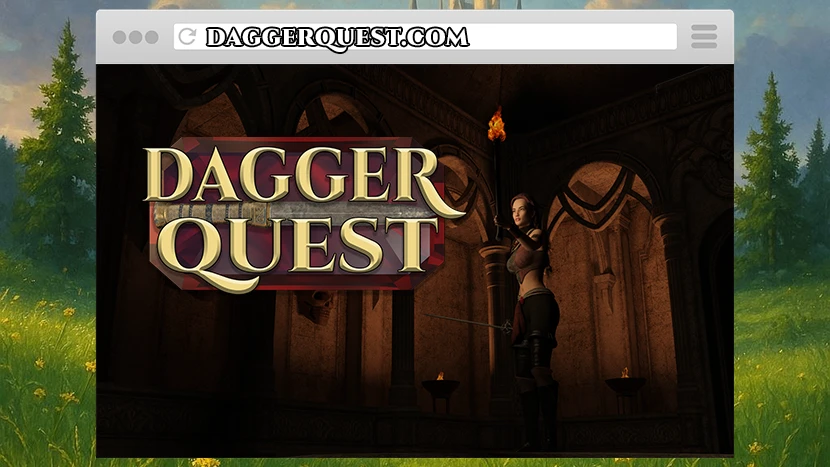

### The official website for *DaggerQuest*

## ⚔️ Play Now

**Play DaggerQuest at: [DaggerQuest.com](https://DaggerQuest.com/)**

## ⚒️ Structure

*DaggerQuest* is embedded directly onto the homepage and playable within the browser. You can also see the latest news posts, read the guide, download wallpapers and more.

## 🧙‍♂️ Development

### Prerequisites
- Node.js (v18+ recommended)
- npm or yarn

### Getting Started

1. **Clone the repository**
```bash
git clone https://github.com/Vineyard-Technologies/DaggerQuest.com.git
cd DaggerQuest.com
```

2. **Install dependencies**
```bash
npm install
```

3. **Start development server**
```bash
npm run dev
```

The development server will start at `http://localhost:5173` with hot reload enabled.


### Project Structure

```
├── src/
│   ├── components/     # Reusable React components
│   │   ├── Header.jsx      # Site navigation
│   │   ├── Footer.jsx      # Site footer
│   │   ├── SEO.jsx         # SEO meta tags
│   │   └── Analytics.jsx   # Google Analytics
│   ├── pages/         # Page components
│   │   ├── Home.jsx        # Homepage with game iframe
│   │   ├── News.jsx        # News listing with pagination
│   │   ├── Media.jsx       # Media gallery
│   │   ├── Guide.jsx       # Game guide with search
│   │   ├── Support.jsx     # Support form
│   │   └── ...
│   ├── App.jsx        # Main app component with routing
│   └── main.jsx       # React entry point
├── public/            # Static assets
│   ├── game/              # Game files
│   ├── images/            # Images and wallpapers
│   └── style.css          # Main stylesheet
├── index.html         # HTML template
├── vite.config.js     # Vite configuration
└── package.json       # Dependencies and scripts
```

## 📄 Website Pages

- [**Homepage**](https://DaggerQuest.com/) - Embedded *DaggerQuest* client with React components
- [**News**](https://DaggerQuest.com/news) - Latest updates and announcements with React pagination
- [**Guide**](https://DaggerQuest.com/guide) - Gameplay instructions and tips with search functionality
- [**Media**](https://DaggerQuest.com/media) - Screenshots and promotional materials gallery
- [**Support**](https://DaggerQuest.com/support) - Help and contact information with embedded Google Form
- [**Privacy Policy**](https://DaggerQuest.com/privacy-policy) & [**Terms of Use**](https://DaggerQuest.com/terms-of-use) - Legal documents

### Environment Variables

The application automatically detects the production environment (`DaggerQuest.com`) for:
- Google Analytics tracking
- Google AdSense ads
- Production-specific features

## 🔧 Technical Features

### React Components
- **SEO Component** - Dynamic meta tags and structured data
- **Analytics Component** - Google Analytics integration
- **Responsive Header/Footer** - Mobile-friendly navigation
- **Page Components** - Modular page structure

### SEO Features
- Dynamic meta tags per page
- Open Graph and Twitter Card support
- Structured data (JSON-LD)
- Canonical URLs
- Sitemap generation

## 📋 Related Repositories

- [**DaggerQuest**](https://github.com/Vineyard-Technologies/DaggerQuest) - The main repository for the *DaggerQuest* codebase.
- [**DaggerQuest Test Realm**](https://github.com/Vineyard-Technologies/DaggerQuest-Test-Realm) - The test realm for *DaggerQuest* - See a preview of updates before they go live.
- [**DaggerTest**](https://github.com/Vineyard-Technologies/DaggerTest) - An automated testing suite for *DaggerQuest*.
- [**Overlord**](https://github.com/Vineyard-Technologies/Overlord) - An render pipeline management tool used to generated assets for *DaggerQuest*.
- [**CAFfeine**](https://github.com/Vineyard-Technologies/CAFfeine) - An automation and testing framework for *DaggerQuest* and Construct 3 in general.

## ✒️ License

This project is licensed under the [AGPL 3.0 License](https://www.gnu.org/licenses/agpl-3.0.html.en) - see the [LICENSE](LICENSE) file for details.